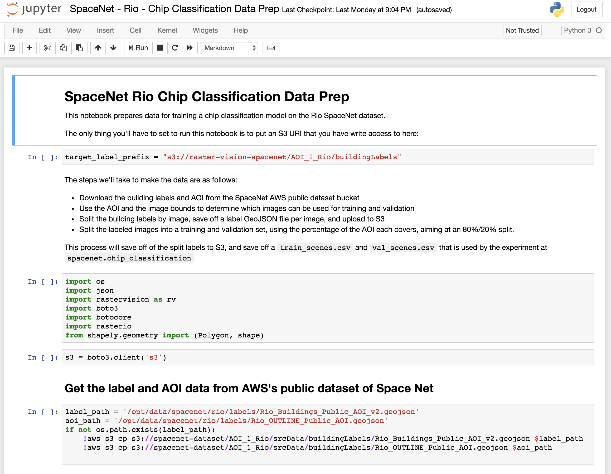

# Raster Vision Example Repository

This repository holds examples for Raster Vision usage on open datasets.

Table of Contents:
- [Setup and Requirements](#setup-and-requirements)
- [SpaceNet Building Chip Classification](#spacenet-building-chip-classification)

## Setup and Requirements

### Requirements

You'll need `docker` (preferably version 18 or above) installed.

### Setup

To build the examples container, run the following command:

```shell
> scripts/build
```

This will pull down the latest `raster-vision` docker and add some of this repo's code to it.

__Note__: Pre-release, you'll need to build Raster Vision locally for this build step to work. (ie. run `./scripts/update` in `raster-vision`)

### Running the console

Whenever the instructions say to "run the console", it means to spin up an image and drop into a bash shell by doing this:

```shell
> scripts/console
```

This will mount the following directories:
- `${HOME}/.aws` -> `/root/.aws`
- `${HOME}/.rastervision` -> `/root/.rastervision`
- `spacenet` -> `/opt/src/spacenet`
- `notebooks` -> `/opt/notebooks`
- `data` -> `/opt/data`

### Running Jupyter

Whenever intructions say to "run jupyter", it means to run the JupyterHub instance through docker by doing:

```shell
> scripts/jupyter
```

This mounts many of the same directories as `scripts/consle`. The terminal output will give you the URL to go to in order to use JupyterHub.

### Running against AWS

If you want to run code against AWS, you'll have to have a Raster Vision AWS Batch setup
on your account, which you can accomplish through the [Raster Vision AWS repository](https://github.com/azavea/raster-vision-aws).

Make sure to set the appropriate configuration in your `$HOME/.rastervision/default` configuration, e.g.

```ini
[AWS_BATCH]
job_queue=raster-vision-gpu
job_definition=raster-vision-gpu-newapi
```

### QGIS Plugin

We can inspect results quickly by installing the [QGIS plugin](https://github.com/azavea/raster-vision-qgis). This is an optional step, and requires QGIS 3. See that repository's README for more installation instructions.

## Spacenet Building Chip Classification

This example performs chip classification to detect buildings in the SpaceNet imagery.
It is set up to train on the Rio dataset.

### Step 1: Run the Jupyter Notebook

You'll need to do some data preprocessing, which we can do in the jupyter notebook supplied.

Run jupyter and navigate to the `spacenet/SpaceNet - Rio - Chip Classification Data Prep` notebook.

Run through this notebook (instructions are included).



### Step 2: Run Raster Vision

The experiment we want to run is in `spacenet/chip_classification.py`.

To run this, get into the docker container by typing:

```
> scripts/console
```

You'll need to pass the experiment an S3 URI that you have write access to, that will serve as a place to store results and configuration - this is what we call the _RV root_. You can pass arguments to experiment methods via the `-a KEY VALUE` command line option.

If you are running locally (which means you're running this against a GPU machine with a good connection), run:

```
> rastervision run local -e spacenet.chip_classification -a root_uri ${RVROOT}
```

If you are running on AWS Batch, run:
```
> rastervision run aws_batch -e spacenet.chip_classification -a root_uri ${RVROOT}
```

where `${RVROOT}` is your RV root, for instance `s3://raster-vision-rob-dev/spacenet/cc`

Your console output should look something like this if you are running against AWS:


### Step 3: Inspect Evaluation results

After everything completes, which should take about 3 hours if you're running on AWS with p3.2xlarges,
you should be able to find the `eval/spacenet-rio-chip-classification/eval.json` evaluation
JSON. This is an example of the scores from a run:

```javascript
[
    {
        "gt_count": 1460.0,
        "count_error": 0.0,
        "f1": 0.962031922725018,
        "class_name": "building",
        "recall": 0.9527397260273971,
        "precision": 0.9716098420590342,
        "class_id": 1
    },
    {
        "gt_count": 2314.0,
        "count_error": 0.0,
        "f1": 0.9763865660344931,
        "class_name": "no_building",
        "recall": 0.9822817631806394,
        "precision": 0.9706292067263268,
        "class_id": 2
    },
    {
        "gt_count": 3774.0,
        "count_error": 0.0,
        "f1": 0.970833365390128,
        "class_name": "average",
        "recall": 0.9708532061473236,
        "precision": 0.9710085728062825,
        "class_id": -1
    }
]
```

Which shows us an f1 score of `0.96` for detecting chips with buildings, and an average f1 of `0.97`.

### Step 4: View results through QGIS plugin

Those numbers look good, but seeing the imagery and predictions on a map will look better.
To do this, we utilize the QGIS plugin to pull down one of the validation images.

A walkthrough of using QGIS to inspect these results can be found [in the QGIS plugin README](https://github.com/azavea/raster-vision-qgis#tutorial-view-spacenet-building-chip-classification)

Viewing the validation scene results for scene ID `013022232023` looks like this:


