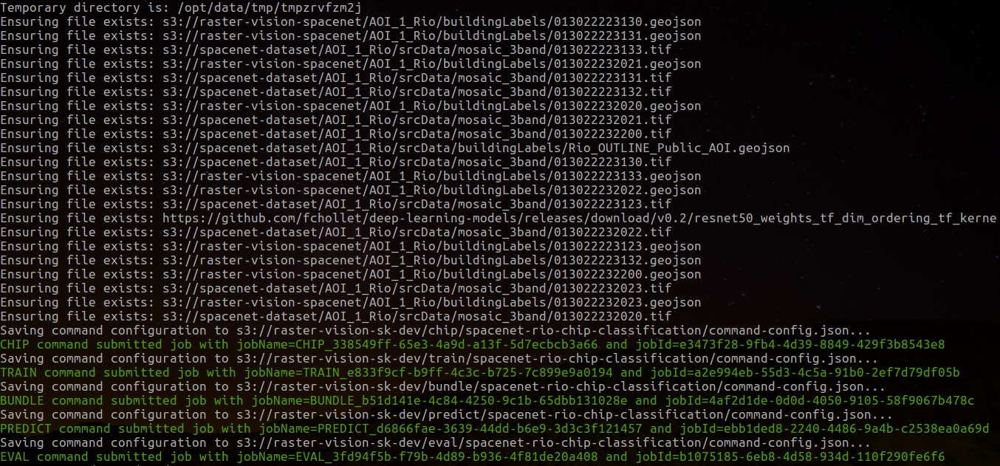
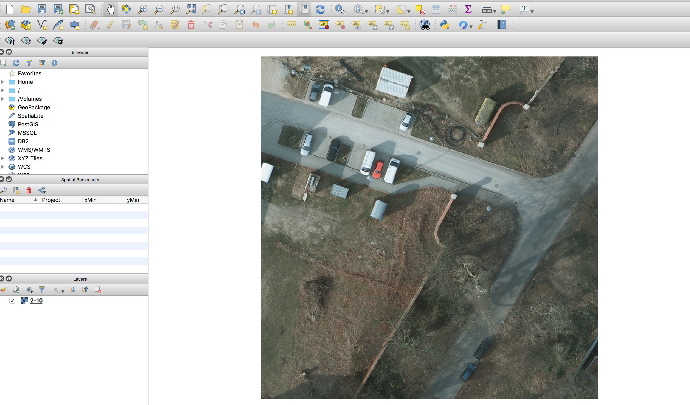
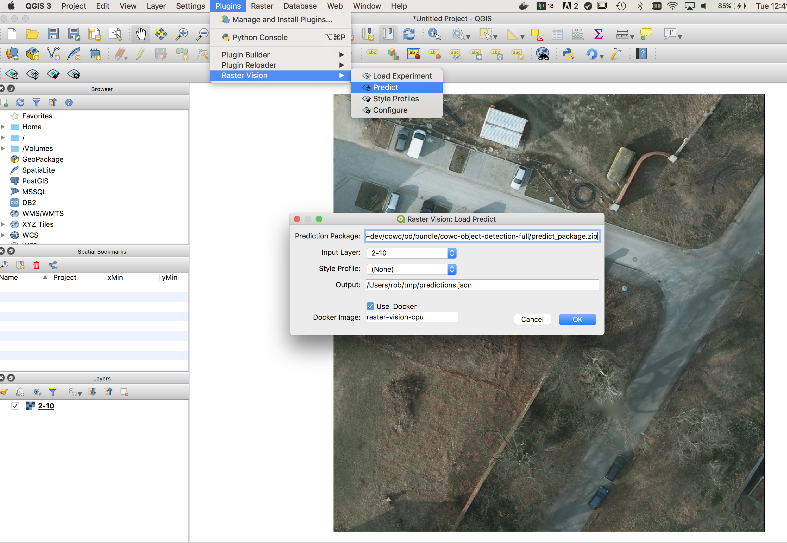
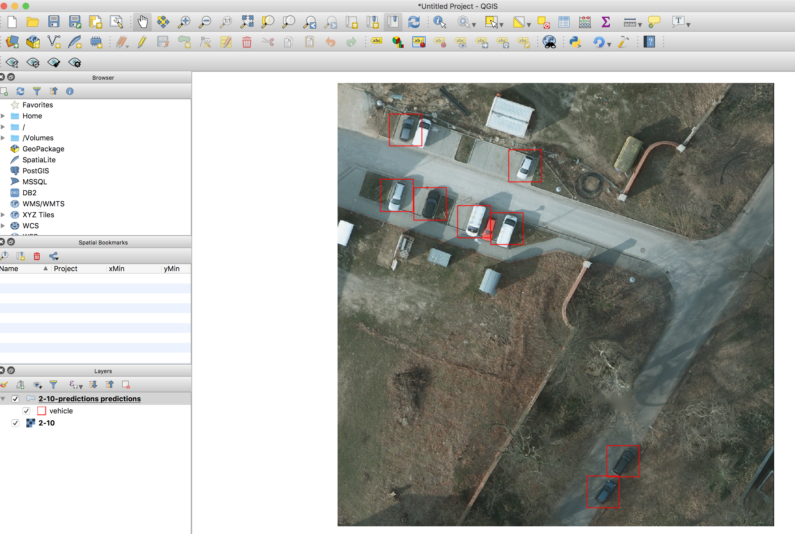
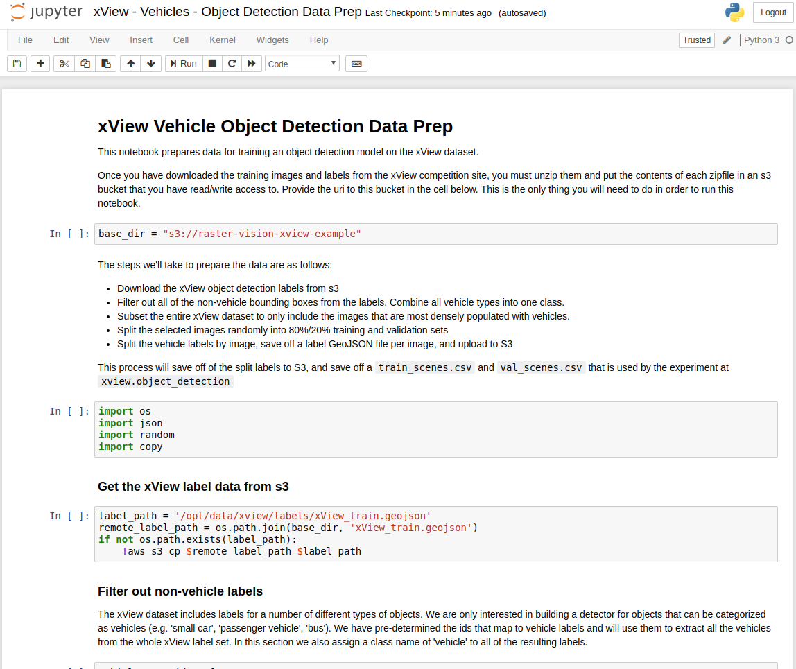

# Raster Vision Example Repository

This repository holds examples for Raster Vision usage on open datasets.

Table of Contents:
- [Setup and Requirements](#setup-and-requirements)
- [SpaceNet Building Chip Classification](#spacenet-building-chip-classification)
- [ISPRS Potsdam Semantic Segmentation](#isprs-potsdam-semantic-segmentation)
- [COWC Potsdam Car Object Detection](#cowc-potsdam-car-object-detection)
- [xView Vehicle Object Detection](#xview-vehicle-object-detection)

## Setup and Requirements

### Requirements

You'll need `docker` (preferably version 18 or above) installed.

### Setup

To build the examples container, run the following command:

```shell
> scripts/build
```

This will pull down the latest `raster-vision` docker and add some of this repo's code to it.

__Note__: Pre-release, you'll need to build Raster Vision locally for this build step to work. (ie. run `./scripts/update` in `raster-vision`)

### Running the console

Whenever the instructions say to "run the console", it means to spin up an image and drop into a bash shell by doing this:

```shell
> scripts/console
```

This will mount the following directories:
- `${HOME}/.aws` -> `/root/.aws`
- `${HOME}/.rastervision` -> `/root/.rastervision`
- `spacenet` -> `/opt/src/spacenet`
- `notebooks` -> `/opt/notebooks`
- `data` -> `/opt/data`

### Running Raster Vision

Each example will at some point run the `rastervision` command line. See `rastervision --help` and `rastervision run --help` for usage information.

Use `-a` to pass arguments into the experiment methods; many of which take a `root_uri`, which is where Raster Vision will store all the output of the experiment. If you forget to supply this, Raster Vision will remind you.

Using the `-n` or `--dry-run` flag is useful to see what you're about to run before you run it.
Combine this with the verbose flag for different levels of output:

```
> rastervision run spacenet.chip_classification -a root_uri s3://example/ --dry_run
> rastervision -v run spacenet.chip_classification -a root_uri s3://example/ --dry_run
> rastervision -vv run spacenet.chip_classification -a root_uri s3://example/ --dry_run
```

Use `-x` to avoid checking if files exist, which can take a long time for large experiments.
This is useful to do the first run, but if you haven't changed anything about the experiment and
are sure the files are there, it's often nice to skip that step.

### Running Jupyter

Whenever intructions say to "run jupyter", it means to run the JupyterHub instance through docker by doing:

```shell
> scripts/jupyter
```

This mounts many of the same directories as `scripts/consle`. The terminal output will give you the URL to go to in order to use JupyterHub.

### Running against AWS

If you want to run code against AWS, you'll have to have a Raster Vision AWS Batch setup
on your account, which you can accomplish through the [Raster Vision AWS repository](https://github.com/azavea/raster-vision-aws).

Make sure to set the appropriate configuration in your `$HOME/.rastervision/default` configuration, e.g.

```ini
[AWS_BATCH]
job_queue=rasterVisionQueueStaging
job_definition=raster-vision-gpu
```

### QGIS Plugin

We can inspect results quickly by installing the [QGIS plugin](https://github.com/azavea/raster-vision-qgis). This is an optional step, and requires QGIS 3. See that repository's README for more installation instructions.

### Viewing Tensorboard

During the training step of experiments that have backends that support
[Tensorboard](https://github.com/tensorflow/tensorboard), you should be able to view Tensorboard
at either `localhost:6006/` if you are running locally, or `<public_dns>:6006` if you are running
on AWS, where `<public_dns>` is the pulbic DNS of the instance that is running the training job.

## Spacenet Building Chip Classification

This example performs chip classification to detect buildings in the [SpaceNet](https://spacenetchallenge.github.io/) imagery.
It is set up to train on the Rio dataset.

### Step 1: Run the Jupyter Notebook

You'll need to do some data preprocessing, which we can do in the jupyter notebook supplied.

Run jupyter and navigate to the `spacenet/SpaceNet - Rio - Chip Classification Data Prep` notebook.

Run through this notebook (instructions are included).


### Step 2: Run Raster Vision

The experiment we want to run is in `spacenet/chip_classification.py`.

To run this, get into the docker container by typing:

```
> scripts/console
```

You'll need to pass the experiment an S3 URI that you have write access to, that will serve as a place to store results and configuration - this is what we call the _RV root_. You can pass arguments to experiment methods via the `-a KEY VALUE` command line option.

If you are running locally (which means you're running this against a GPU machine with a good connection), run:

```
> rastervision run local -e spacenet.chip_classification -a root_uri ${RVROOT}
```

If you are running on AWS Batch, run:
```
> rastervision run aws_batch -e spacenet.chip_classification -a root_uri ${RVROOT}
```

where `${RVROOT}` is your RV root, for instance `s3://raster-vision-rob-dev/spacenet/cc`

Your console output should look something like this if you are running against AWS:



### Step 3: Inspect Evaluation results

After everything completes, which should take about 3 hours if you're running on AWS with p3.2xlarges,
you should be able to find the `eval/spacenet-rio-chip-classification/eval.json` evaluation
JSON. This is an example of the scores from a run:

```javascript
[
    {
        "gt_count": 1460.0,
        "count_error": 0.0,
        "f1": 0.962031922725018,
        "class_name": "building",
        "recall": 0.9527397260273971,
        "precision": 0.9716098420590342,
        "class_id": 1
    },
    {
        "gt_count": 2314.0,
        "count_error": 0.0,
        "f1": 0.9763865660344931,
        "class_name": "no_building",
        "recall": 0.9822817631806394,
        "precision": 0.9706292067263268,
        "class_id": 2
    },
    {
        "gt_count": 3774.0,
        "count_error": 0.0,
        "f1": 0.970833365390128,
        "class_name": "average",
        "recall": 0.9708532061473236,
        "precision": 0.9710085728062825,
        "class_id": -1
    }
]
```

Which shows us an f1 score of `0.96` for detecting chips with buildings, and an average f1 of `0.97`.

### Step 4: View results through QGIS plugin

Those numbers look good, but seeing the imagery and predictions on a map will look better.
To do this, we utilize the QGIS plugin to pull down one of the validation images.

A walkthrough of using QGIS to inspect these results can be found [in the QGIS plugin README](https://github.com/azavea/raster-vision-qgis#tutorial-view-spacenet-building-chip-classification)

Viewing the validation scene results for scene ID `013022232023` looks like this:


## ISPRS Potsdam Semantic Segmentation

This example performs semantic segmentation on the [ISPRS Potsdam dataset](http://www2.isprs.org/commissions/comm3/wg4/2d-sem-label-potsdam.html). The dataset consists of 5cm aerial imagery over Potsdam, Germany, segmented into six classes including building, tree, low vegetation, impervious, car, and clutter. For more info see our [blog post](https://www.azavea.com/blog/2017/05/30/deep-learning-on-aerial-imagery/).

### Step 1: Download the dataset

The dataset can only be downloaded after filling in this [request form](http://www2.isprs.org/commissions/comm3/wg4/data-request-form2.html). After your request is granted, follow the link to 'POTSDAM 2D LABELING' and download and unzip `1_DSM_normalisation.zip`, `4_Ortho_RGBIR.zip`, and `5_Labels_for_participants.zip` into `data/`.

### Step 2: Run experiment

The experiment we want to run is in `potsdam/semantic_segmentation.py`. This runs a Mobilenet using the Tensorflow Deeplab backend for 100k steps, which takes about six hours to train on an AWS P3 instance.

To do a small test run locally to check that things are setup properly, invoke
```
> rastervision run local -e potsdam.semantic_segmentation \
    -a test_run True -a root_uri ${ROOT_URI} -a data_uri ${DATA_URI}
```
This only trains the model for one step, so the predictions will be random.

To run a full experiment on AWS Batch, upload the data to S3, set `ROOT_URI` and `DATA_URI` to S3 URIs, and invoke
```
> rastervision run aws_batch -e potsdam.semantic_segmentation \
    -a root_uri ${ROOT_URI} -a data_uri ${DATA_URI}
```

### Step 3: Inspect Evaluation results

After running for around 6 hours on a P3 instance, you should have the following evaluation results in `${DATA_URI}/eval/potsdam-seg/eval.json`

```javascript
[
    {
        "precision": 0.8656729563616176,
        "gt_count": 1746655,
        "class_id": 1,
        "recall": 0.8081258176342782,
        "count_error": 200350.09143477102,
        "class_name": "Car",
        "f1": 0.8351868892794376
    },
    {
        "precision": 0.9077043151132905,
        "gt_count": 28166583,
        "class_id": 2,
        "recall": 0.9453450210840271,
        "count_error": 1496358.1113330645,
        "class_name": "Building",
        "f1": 0.9259374145605163
    },
    {
        "precision": 0.8105826727015737,
        "gt_count": 30140893,
        "class_id": 3,
        "recall": 0.8826813459043832,
        "count_error": 3813131.239710051,
        "class_name": "Low Vegetation",
        "f1": 0.8448803483993653
    },
    {
        "precision": 0.8853166963497794,
        "gt_count": 16928529,
        "class_id": 4,
        "recall": 0.7333917790494379,
        "count_error": 2298428.025324646,
        "class_name": "Tree",
        "f1": 0.798672495115001
    },
    {
        "precision": 0.8905422564785969,
        "gt_count": 29352493,
        "class_id": 5,
        "recall": 0.8771725795147962,
        "count_error": 2346809.6169586345,
        "class_name": "Impervious",
        "f1": 0.883793546499612
    },
    {
        "precision": 0.40612390917761676,
        "gt_count": 1664847,
        "class_id": 6,
        "recall": 0.3042724046113547,
        "count_error": 759642.5306962142,
        "class_name": "Clutter",
        "f1": 0.3474061991276365
    },
    {
        "precision": 0.8640141242953602,
        "gt_count": 108000000,
        "class_id": null,
        "recall": 0.8640043796296297,
        "count_error": 2467470.602260491,
        "class_name": "average",
        "f1": 0.8615277511625675
    }
]
```

### Step 4: View results through QGIS plugin

TODO

## COWC Potsdam Car Object Detection

This example performs object detection on cars with the Cars Overhead With Context dataset over Potsdam, Germany.

### Small local test case

#### Step 1: Download data

Download and unzip the [test data](https://s3.amazonaws.com/azavea-research-public-data/raster-vision/examples/cowc/cowc-potsdam-test-data.zip) to data/cowc/potsdam-local. These are cropped GeoTIFFs and labels that are a small subset of the full dataset.

Inside the docker container:

```console
> mkdir -p /opt/data/cowc/potsdam-local
> wget -O /opt/data/cowc/potsdam-local/data.zip https://s3.amazonaws.com/azavea-research-public-data/raster-vision/examples/cowc/cowc-potsdam-test-data.zip
> unzip /opt/data/cowc/potsdam-local/data.zip -d /opt/data/cowc/potsdam-local/
```

#### Step 2: Run the experiment

Inside the docker container, run:

```
> rastervision run local -e cowc.object_detection -m *local
```

You can visit https://localhost:6006/ to view tensorboard as the model trains.

Since this is a local test, you shouldn't expect to see good results -
this was simply a runthrough to show how to train a model locally.

### Running a larger test on the full dataset

The follow describes how to run against a larger set of data.

#### Step 1: Get the data

To run the larger set, follow these steps. Replace `${ROOT_URI}` with the directory that will be passed
into the experiment as `root_uri`, which can be local if you're running on a GPU machine or S3.

* In order to run this section, you'll need to get some data from ISPRS.
Download the [ISPRS Potsdam](http://www2.isprs.org/commissions/comm3/wg4/2d-sem-label-potsdam.html) imagery using the [data request form](http://www2.isprs.org/commissions/comm3/wg4/data-request-form2.html) and place it in `${ROOT_URI}/isprs-potsdam`.
* Copy the [cowc-potsdam labels](https://github.com/azavea/raster-vision-data/releases/download/v0.0.1/cowc-potsdam-labels.zip), unzip, and place the files in `${ROOT_URI}/labels/`. These files were generated from the [COWC car detection dataset](https://gdo152.llnl.gov/cowc/) using scripts in [cowc.data](cowc/data/).

#### Step 2: Run the experiment

Inside the docer container, run

```console
> rastervision run local -e cowc.object_detection -f *full -a root_uri ${ROOT_URI}
```

### See predictions in QGIS

After the model is trained, we can use the "predict package" to make predictions
in QGIS via the QGIS plugin.

#### Step 1: Find the prediction package

This should be at `${ROOT_URI}/bundle/cowc-object-detection-full/predict_package.zip`

#### Step 2: Load up the local image in QGIS

Load up a project in QGIS that has one of the local sample images at
`data/cowc/potsdam-local/cowc-potsdam-test`



#### Step 3: Predict

Use the Predict dialog and set your predict package URI to the URI from Step 1.



After spinning a bit the predictions should look something like this:



## xView Vehicle Object Detection

This example performs object detection to detect vehicles in the xView imagery.
It includes two experiments - one with the smaller [Mobilenet V1](https://github.com/tensorflow/models/blob/5fd32ef62e37a8124bf8849f7bea65fbd8cd7bdd/research/slim/nets/mobilenet_v1.md), and
the other uses a [Faster RCNN utilizning a by RESNET50](https://arxiv.org/abs/1506.01497).

You can either model or both; if you run both, you'll see an example of how a larger network
performs with a significant amount of training data vs a smaller network.

### Step 1: Download the Data

Sign up for an account for the [DIUx xView Detection Challenge](http://xviewdataset.org/). Navigate to the [downloads page](https://challenge.xviewdataset.org/download-links) and download the zipped training images and labels.  Unzip both of these files and upload their contents to an s3 bucket that you have read/write access to. Once this is done, the bucket should contain a labels geojson called `xView_train.geojson` and a directory called `train_images`. You will use the uri to this dataset as input to the data prep Jupyter Notebook in step 2.

### Step 2: Run the Jupyter Notebook

You'll need to do some data preprocessing, which we can do in the jupyter notebook supplied.

Run jupyter and navigate to the `xview/xView - Vehicles - Object Detection Data Prep` notebook.

Run through this notebook (instructions are included).



### Step 3: Run the experiment(s)

To run the mobilenet experiment, inside the docker container run

```
> rastervision run ${RUNNER} -e xview.object_detection -f *mobilenet* -a ${ROOT_URI}
```

To run the resnet experiment, run

```
> rastervision run ${RUNNER} -e xview.object_detection -f *resnet* -a ${ROOT_URI}
```

and to run both, simply

```
> rastervision run ${RUNNER} -e xview.object_detection -a ${ROOT_URI}
```

where `${ROOT_URI}` is the URI set up in jupyter notebook, and ${RUNNER} is
the type of runner you are using, e.g. `local` or `aws_batch`.
